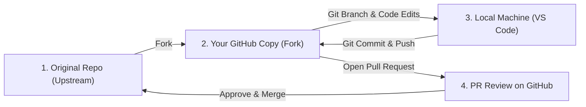

# 📖 The Complete Beginner's Guide to Git & GitHub Pull Requests (PR)

Welcome! This guide explains what a **Pull Request (PR)** is, why developers use them worldwide, how the complete PR workflow operates step-by-step, and how we created **Pull Request #1** today.

---

## 💡 1. What is a Pull Request (PR)?

Imagine you and your friend are writing a book or working on a shared Google Doc. Instead of changing your friend's original document directly, you make a copy (a draft), write your new chapters or fix typos, and then ask your friend: 

> *"Hey! I improved these 3 pages. Please review my changes and pull them into the main document if you like them!"*

In open-source software and team development, that request is called a **Pull Request (PR)**. You are requesting that the project owner **pull (merge)** your code changes into their repository.

---

## 🎯 2. Why Do Developers Use Pull Requests?

1. **Code Safety**: Nobody can accidentally break the main game code (`main` branch) by pushing untested code directly.
2. **Peer Review**: Team members can view line-by-line code comparisons (**Diffs**) before approving changes.
3. **Collaboration & Discussion**: Developers can comment on specific lines of code, ask questions, or request small adjustments.
4. **Version Tracking**: Gives a clear audit history of who added which feature and when.

---

## 🔄 3. The 5-Step Pull Request Lifecycle

### Step 1: Forking (Your Personal Copy)
- **What it is**: Creating your own personal copy of an open-source or friend's repository under your GitHub account.
- **Example**: Forking `Ghostofzenin08/Game--Development-In-Python` to `parthongit89/Game--Development-In-Python`.

### Step 2: Branching (Isolated Workspace)
- **What it is**: Creating a separate branch (e.g. `refactor-galaxy-shooters`) so your changes are organized separately from the `main` branch.
- **Command**: `git checkout -b feature-branch-name`

### Step 3: Committing & Pushing (Saving Changes)
- **What it is**: Saving your work locally (`git commit`) and pushing those commits up to your GitHub fork (`git push`).
- **Command**: `git add .` -> `git commit -m "Description"` -> `git push origin feature-branch-name`

### Step 4: Opening the Pull Request
- **What it is**: Going to GitHub, clicking **"Compare & Pull Request"**, and writing a clear **Title** and **Description** explaining what you built or fixed.

### Step 5: Code Review & Merging
- **What it is**: The owner reviews your code diffs, tests your feature, and clicks the green **"Merge Pull Request"** button. Your code is now part of the main project!

---

## 🛠️ 4. Quick Git Command Cheat Sheet

| Action | Command | What It Does |
| :--- | :--- | :--- |
| **Check Status** | `git status` | Shows modified or uncommitted files |
| **Create Branch** | `git checkout -b <name>` | Creates and switches to a new branch |
| **Stage Changes** | `git add <file>` | Prepares modified files for saving |
| **Commit Changes**| `git commit -m "Message"` | Saves staged changes with a message |
| **Push to GitHub** | `git push origin <name>` | Uploads your branch to GitHub |
| **Pull Updates** | `git pull upstream main` | Fetches latest updates from main repo |

---

## 🌟 5. What We Did Today (Real-World Case Study)

1. **Refactored Galaxy Shooters**: Fixed controls (WASD/Mouse), responsive full-screen mode (`F11`), master audio muting, dual-nozzle plasma thrusters, and level progression.
2. **Created Clean Branch**: Synced with `upstream/main` to create `pr-clean-branch`.
3. **Pushed to Fork**: Pushed `pr-clean-branch` to `parthongit89/Game--Development-In-Python`.
4. **Submitted PR #1**: Opened Pull Request #1 on `Ghostofzenin08/Game--Development-In-Python` ([PR #1 Link](https://github.com/Ghostofzenin08/Game--Development-In-Python/pull/1)).

Congratulations on submitting your first Pull Request! 🚀
